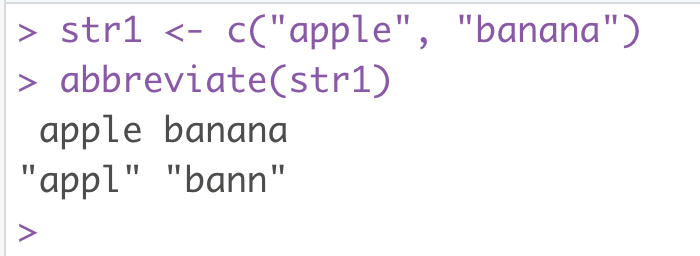

### 中文心得
### 學習 r base function


#### abbreviate

```r

# function: abbreviate
# 輸入字串，並回傳字串縮寫

```

#### example

```r
str1 <- c("apple", "banana")
abbreviate(str1)
```
img1



```r
# 參數
# minlength:     (num)     回傳縮寫的長度
# use.classes :  (logical) 小寫的英文是不是該被抹除
# dot :          (logical) 回傳的字串字尾要不要有 "."
# strict :       (logical) 是否要嚴格遵守 minlength 的字數限制, if T, 可能回傳一樣的縮寫
# method :       (char)    縮寫使用方法, 預設方法為 "left.kept", 保留左邊為主, 還有 "both.sides" 可使用
# named :        (logical) 原本字串是否要回傳, if T, 會以 names 形式回傳
```
